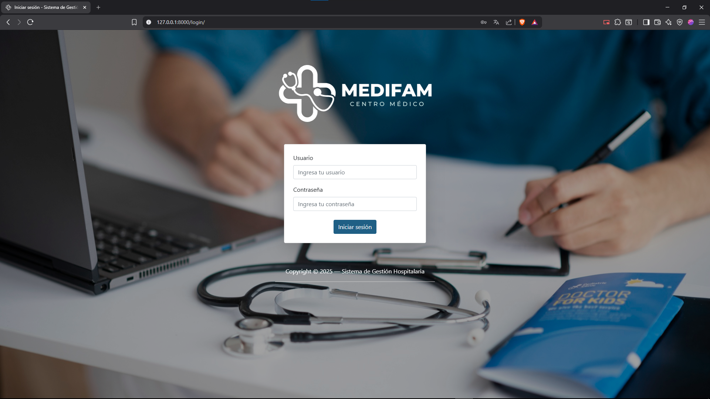
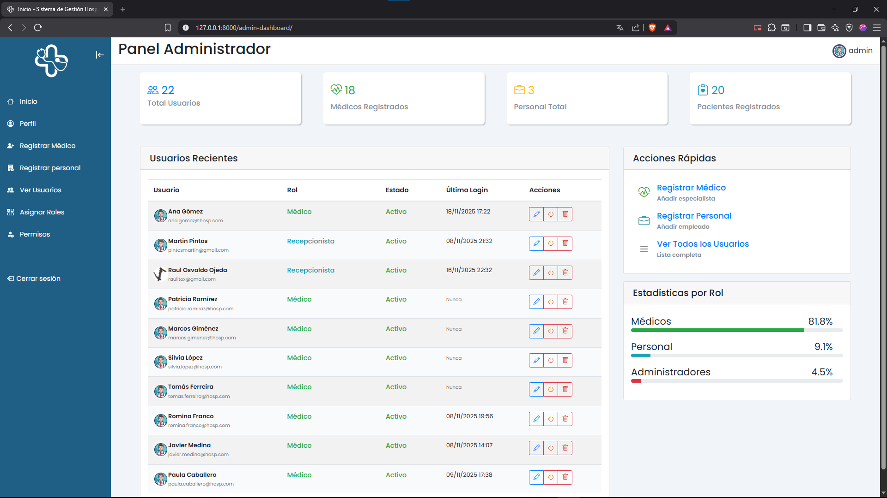
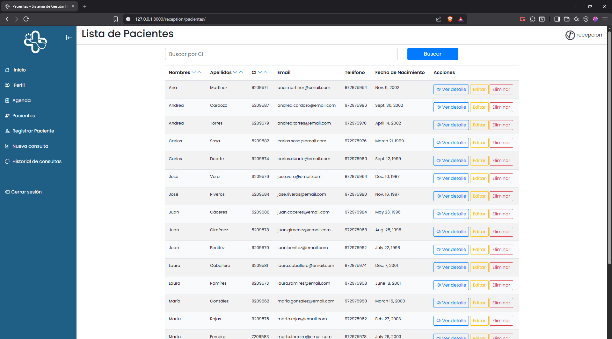
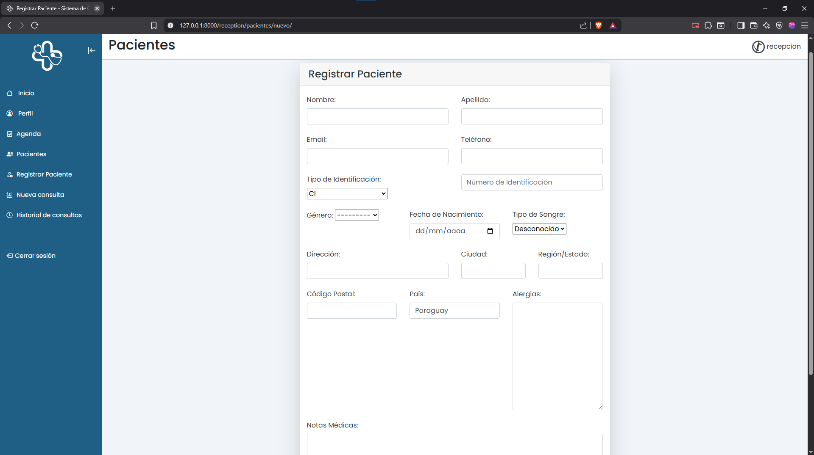
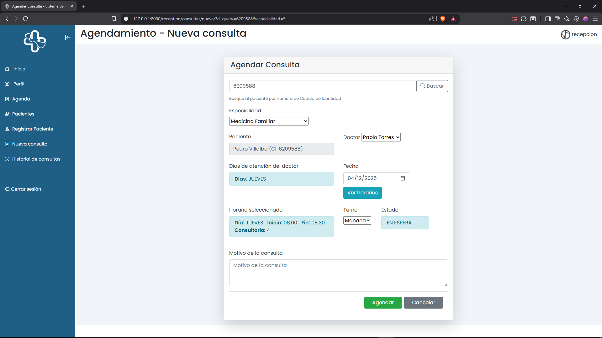
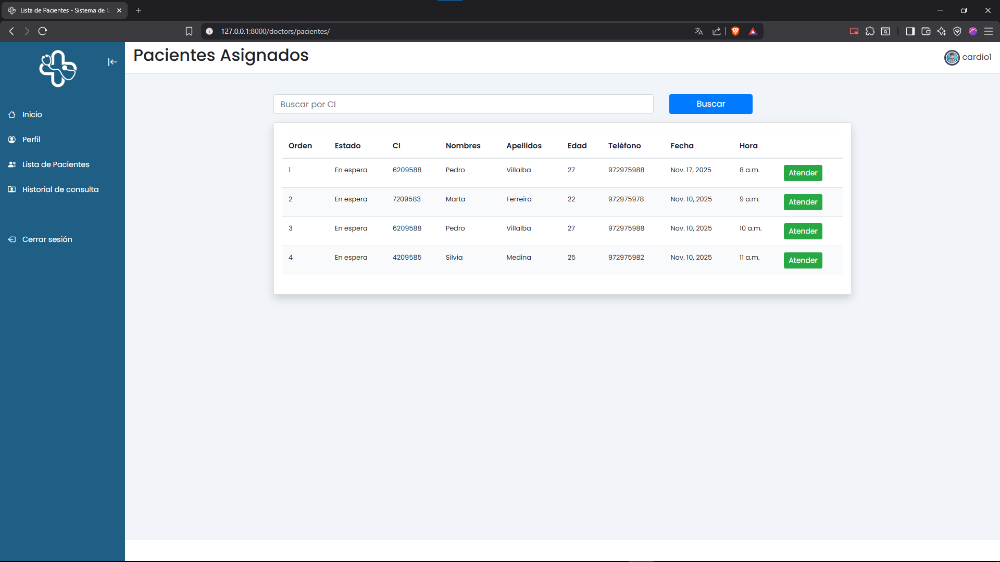
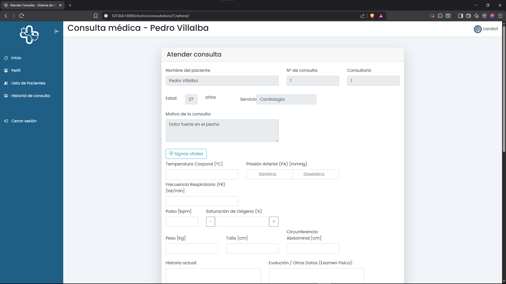
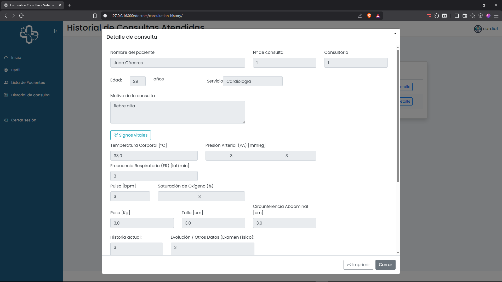

# Sistema de Gestión Hospitalaria (SGH)

Aplicación web diseñada para agilizar, optimizar y organizar la interacción entre recepción, médicos y pacientes. Permite agendar y gestionar consultas por especialidad, atenderlas y dejar constancia clínica de cada atención.

## Descripción general
El recepcionista agenda consultas médicas según especialidad y disponibilidad del profesional. Los médicos visualizan su agenda, atienden las consultas asignadas y registran el resultado (diagnóstico, indicaciones y recetas). Cada tipo de usuario trabaja en un panel personalizado con opciones adaptadas a su rol.

## Objetivos
- Centralizar la información clínica y administrativa.
- Reducir tiempos de atención y errores de registro.
- Mantener trazabilidad de consultas, pacientes y profesionales.
- Ofrecer una interfaz clara y responsiva para cada rol. 

## Roles y paneles
- Recepción: agenda, reprograma y confirma consultas; registra/edita pacientes. 
- Médico: consulta su agenda, atiende y documenta la atención; emite recetas. 
- Administrador: gestiona usuarios, roles, permisos y especialidades. 
- Paciente: perfil básico (datos demográficos y contacto). 

## Funcionalidades clave
- Gestión de usuarios y perfiles (Users + Doctor/Reception/Administrator).
- Catálogo de especialidades médicas (Specialty).
- Registro completo de pacientes, con validaciones y cálculo de edad (Patient). 
- Agenda y atención de consultas (Consultation) y emisión de recetas (Prescription). 
- Horarios por médico (DoctorSchedule). 
- Manejo de archivos estáticos y media (avatares, etc.).
 
## Entidades principales del dominio
- Users (extiende AbstractUser), Doctor, Receptions, Administrator. 
- Patient (datos demográficos, contacto de emergencia, doctor asignado).
- Specialty (especialidades), Consultation (consulta médica), Prescription (receta).
- DoctorSchedule (horarios)

## Arquitectura
- Monolito Django con patrón MTV (Model–Template–View).
- Apps por dominio: `users`, `doctors`, `reception`, `administrator`.
- Presentación por plantillas segmentadas por rol (templates/), recursos en `static/` y archivos subidos en `media/`.
- Documentación técnica con Sphinx (docs/).
- Estructura básica del proyecto:


## Flujo básico
1. Recepción registra al paciente y agenda una consulta con un médico de una especialidad.
2. El médico visualiza su agenda, atiende la consulta y registra el resultado.
3. Se generan registros clínicos y, si corresponde, una receta vinculada a la consulta.
4. Administración supervisa usuarios, permisos y catálogo de especialidades.

## Beneficios
- Procesos ordenados por rol y reducción de fricciones operativas.
- Datos consistentes mediante validaciones y modelos de dominio claros.
- Escalable: nuevas especialidades o reglas se integran como nuevas vistas/modelos dentro del monolito.

## Instalación

**Pre-requisitos**: 
- Python
- pip
- virtualenv

**1 - Crear el directorio**: abrir el terminal y crear el directorio en donde se guardara el proyecto.

```bash
  mkdir CRUD #Para crear el directorio 
```
    
**2 - Clonar el repositorio**: posicionarse en el directorio donde se desea clonar el repositorio y ejecutar git clone

```bash
  cd CRUD
  git clone https://github.com/enridami/simple_crud.git
```

**3 - Crear el entorno virtual:** ingresar cualquiera de las dos opciones para crear el entorno virtual en la carpeta del proyecto

```bash
  virtualenv env
```


```bash
  python -m venv env
```

**4 - Iniciar el entorno virtual:**

```bash
  env\Scripts\activate
```

**5 - Instalar las dependencias requeridas:**

```bash
  pip install -r requirements.txt
```

**6 - Aplicar las migraciones para configurar la base de datos:**

```bash
  python manage.py makemigrations
  python manage.py migrate
```


## Despligue

**Inicializar la aplicación:**

```bash
  python manage.py runserver
```

Una vez realizado todos los pasos abre tu navegador e ingresa al http://localhost:8000/ para acceder al despliegue del proyecto.


## Screenshots










## Autores

- [@enridami](https://www.github.com/enridami) Developer
- [@Gabriel-Gabe](https://github.com/Gabriel-Gabe) Testing - Security
- [@RaulOjeda1122](https://github.com/RaulOjeda1122) Documentation


